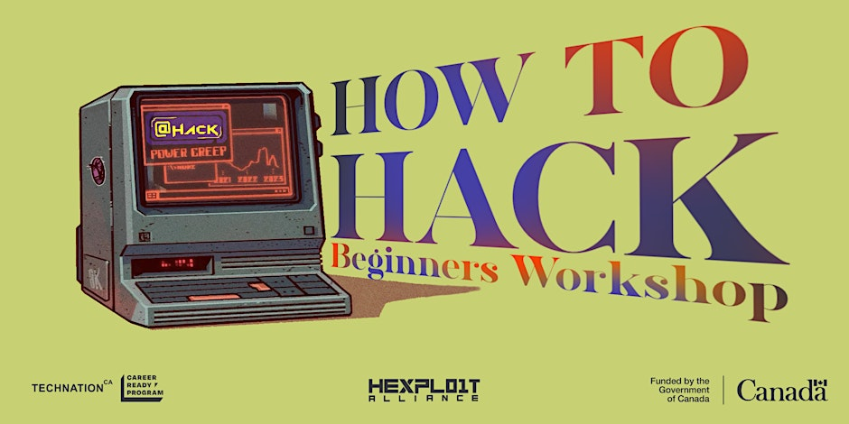

# How To Hack 2025 - Challenges

> Challenges used during How To Hack Workshop 2025 (meant for absolute beginners).



## Running challenges locally

You can either use `docker compose` or `npm` to have all challenges running locally.

### Option 1: Using docker compose (RECOMMENDED)

**Note:** make sure you have `docker` installed.

1. Clone this repository
    ```
    git clone https://github.com/athack-ctf/How-To-Hack-2025-Challenges
    ```
2. Goto `./How-To-Hack-2025-Challenges` directory
    ```
    cd How-To-Hack-2025-Challenges
    ```
3. Run challenges using docker compose
    ```
    docker compose up
    ```
4. Check: http://localhost:2025

### Option 2: Using npm

**Note:** make sure to have `npm` installed.

1. Clone this repository
    ```
    git clone https://github.com/athack-ctf/How-To-Hack-2025-Challenges
    ```
2. Goto `./How-To-Hack-2025-Challenges` directory
    ```
    cd How-To-Hack-2025-Challenges
    ```
3. Install dependencies
    ```
    npm install
    ```
4. Start the challenges
    ```
    npm start
    ```
5. Check: http://localhost:2025

## Follow us for more

| [AtHackCTF](https://www.instagram.com/athackctf)                                                                    | [Hexploit Alliance](https://www.instagram.com/hexploitalliance)                                                            | [TECHNATIONca](https://www.instagram.com/technationca)                                                                 |
|---------------------------------------------------------------------------------------------------------------------|----------------------------------------------------------------------------------------------------------------------------|------------------------------------------------------------------------------------------------------------------------|
|  |  |  |
